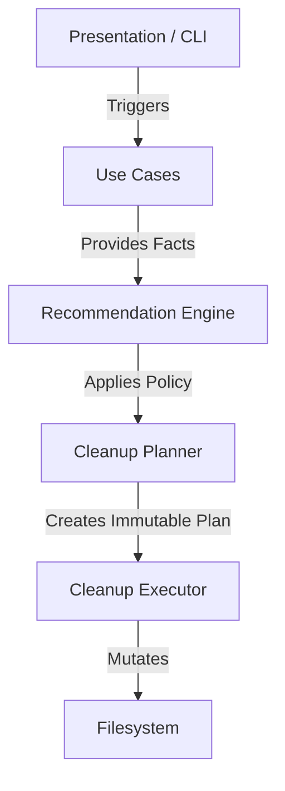

# DevClean

[](https://github.com/JosephJonathanFernandes/DevClean/actions)
[](#)
[](https://www.python.org/)
[](LICENSE)
[](https://github.com/JosephJonathanFernandes/DevClean/releases)
[](https://github.com/astral-sh/ruff)
[](http://mypy-lang.org/)

**DevClean** is an intelligent, filesystem-first storage auditor and transactional cleanup engine for developer workstations.

It helps you discover gigabytes of forgotten artifacts—like massive Python virtual environments, unreferenced Docker images, or stale `node_modules`—and offers explainable, safe recommendations on what to clean up.

## Architecture

DevClean is built on a unidirectional, hexagonal architecture that explicitly separates discovery, policy, planning, and execution. The presentation layer strictly observes this engine.



## Safety & Privacy Guarantees
DevClean is designed for environments where a wrong deletion could ruin a developer's day, and where absolute privacy is non-negotiable.

- **Zero Telemetry**: No analytics, no tracking, and no external API calls during built-in analysis. See our strict [PRIVACY.md](PRIVACY.md) policy.
- **Dry-Run by Default**: Scanning (`devclean scan`) is strictly read-only and never alters your filesystem.
- **Transactional Execution**: The engine creates an immutable `CleanupPlan` that previews the exact bytes to be freed before making any destructive calls.
- **Explainable AI/Logic**: Every recommendation explicitly tells you *why* an artifact is considered stale or safe to remove.
- **Execution History**: The engine maintains a robust, local JSON audit log of every cleanup transaction it performs.

---

## Why DevClean? (Feature Comparison)

| Feature | DevClean | Generic Cleaners |
|---------|----------|------------------|
| **Filesystem-first** | Yes (context-aware logic) | No (regex or path matching) |
| **Explainable recommendations** | Yes | No |
| **Transactional cleanup** | Yes | No |
| **Plugin architecture** | Yes (standard Python entry_points) | Rarely |
| **Dry-run by default** | Yes | Sometimes |
| **Audit history** | Yes | No |
| **Zero Telemetry Guarantee** | Yes | No |

---

## Demo & Screenshots

### Release Demo

*(To record your own demo: Run `vhs demo.tape` using the provided configuration).*

### Interactive Discovery & Planning


### Recommendation Selection


### Detailed Explanations


---

## Features
- **Filesystem-First**: Deterministic, read-only file inspections without relying on third-party CLIs.
- **Event-Driven Progress**: Zero UI polling; CLI components react asynchronously to backend lifecycle events.
- **Plugin System**: Analyzers are independently discoverable and load via `importlib.metadata.entry_points`. Isolated failures do not crash the engine.
- **Machine-Readable**: Emits schemas natively (`--json`, `--ndjson`) for CI/CD automation and `devclean diff` support.

## Usage Workflows

### 1. Interactive Assessment & Cleanup
```bash
devclean scan
devclean cleanup --preview
devclean cleanup
```

### 2. Standalone HTML Reporting
```bash
devclean report --html report.html
```

### 3. Pipeline Automation
```bash
devclean cleanup --preview
if [ $? -eq 3 ]; then
    echo "Cleanup actions are available. Triggering automated execution..."
    devclean cleanup --policy aggressive
fi
```

### 4. Rich Diagnostics
```bash
devclean doctor
devclean version --verbose
```

### 5. Report Diffing
```bash
devclean report --json before.json
# ... days later ...
devclean report --json after.json
devclean diff before.json after.json
```

## Documentation
- [API Stability Guarantees](docs/api_stability.md)
- [Performance Benchmarks](docs/performance.md)

## Development

```bash
# Setup
poetry install

# Formatting and Type-checking
ruff check .
ruff format .
mypy src

# Architecture Enforcement
lint-imports

# Testing
pytest tests -vv
```

## License
MIT
